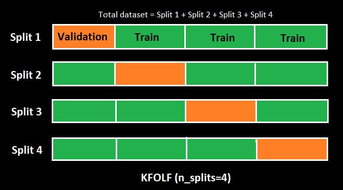

# Holdout x Cross Validation

## Separação de dados (particionamento)

Após a etapa de pré-processamento dos dados vem a etapa de machine learning, a primeira ação do ML é a separação dos dados em:
- Treino: Serve para treinar/ensinar o modelo;
- Validação (Outro particionamento dentro dos dados de treino no CV): Este serve para validar nosso modelo;
- Teste: É o teste final pra comprovar que nosso modelo funciona. Estes dados não participam e nem deve de forma nenhuma participar do treinamento do nosso modelo e só deve ser testado em ultima instância, ou seja, quando nosso modelo já foi escolhido e quando ja estamos com todos os dados de hiperparâmetros em mãos, antes disso jamais use os dados de teste para treinar o modelo pois nessa etapa os dados estão muito sensíveis a overfitting, ocasionando um ajuste excessivo do modelo. 

Importante salientar que essa separação dos dados deve ser feita de maneira aleatória garantindo a diversidade dos dados, o responsável por separar estas amostras são os algoritmos classificadores. 

O classificador é quem garante que temos minimamente caracteristicas parecidas distribuídas entre treino e teste, supomos que nosso objetivo é classificar hipertensão, então o classificador vai garantir que tenha pelo menos 30% de amostras de pessoas com hipertensão distribuídas entre treino e teste. Vamos imaginar mais a fundo uma situação hipotética em que todas as caracteristicas de "pessoa com hipertensão" tenham sido colocadas nos dados de teste, e não sobrou nenhum exemplo de "pessoas com hipertensão" nos dados de treino, como o algoritimo vai acertar quem é hipertenso? impossível!

# Método HoldOut
É o modo mais simples de particionamento, mais rápido e menos custoso em termos de processamento porém não é indicado para grandes volumes de dados pois a menor parte dos dados (teste) pode não ter dado o suficiente para determinar o todo (treino) diminuindo sua acurácia. Esse método consiste em separar os dados (por default) em 70% de treinamento e 30% teste, mas isso é relativo e pode ser ajustado.

Como dissemos anteriormente esse modelo funciona para pequenas quantidades de dados, imagine uma situação em que, você valida seu modelo com acurácia de 80%, e informa ao seu chefe que marca uma apresentação do seu modelo, na apresentação seu modelo apresenta uma acurácia de 63%? Isso vai acontecer! pois sua base de treino e teste muda a cada execução do código implicando em variação da acurácia. No notebook deste tutorial (link no final) fiz uma comparação entre os metodos Holdout e cross validation, note que Holdout sofre variação da sua acurácia enquanto cross validation se mantem estável.

# Cross Validation
Antes de comprender validação cruzada vamos entender que separar dados em treino e teste não é o suficiente para garantir um excelente modelo preditivo, mas o modo como esses dados são separados, ou particionados, é que podem fazer a diferença na acertividade do modelo. 
O Cross validation separa os dados em várias partes e treina cada parte isoladamente, o modo como esses dados serão separados depende do método utilizado, vejamos:

# Métodos de Cross Validation
## 1. Método K-fold
Esse método consiste em dividir os nosso dataset em K partes iguais (n_splits=K), para cada parte K ele executa o HoldOut (treino e teste), porém, aqui chamaremos a parte de teste de validação, como nome diz, é quem valida cada split, garantindo assim que os dados de treino e teste "conhecam" toda nossa base de dados, depois realiza uma média entre esses dados tornando mais acertiva e estável a nossa acurácia.

Há quem diga, que essa validação não deve ser feita balanceamento dos dados, assim estariamos fazendo uma validação mais condizente com a realidade, pois na vida real os dados não estarão balanceados. [Clique aqui para saber mais sobre balanceamento de classes.](https://github.com/dev-daniel-amorim/DS-Balanceamento_de_classes/blob/main/README.md)

## 3. Método Leave-one-out (LOOCV)
É um método de CV pouco usado e custoso por este motivo não é o foco deste tutorial.

## Notebook
[Clique para ver o notebook deste tutorial](https://github.com/dev-daniel-amorim/ML-Holdout_x_CV/blob/main/Holdout%20x%20Cross%20Validation.ipynb)
